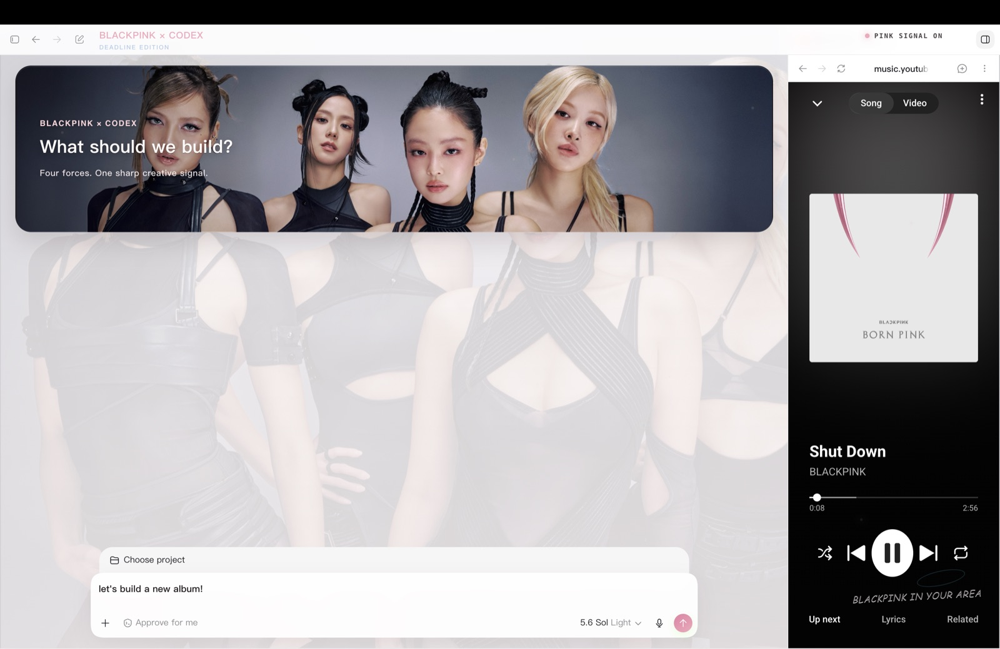
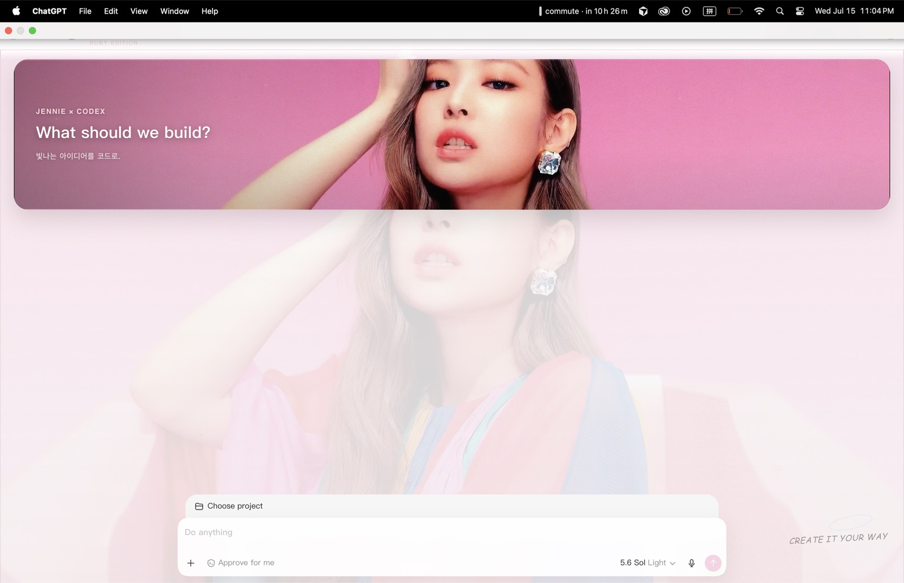
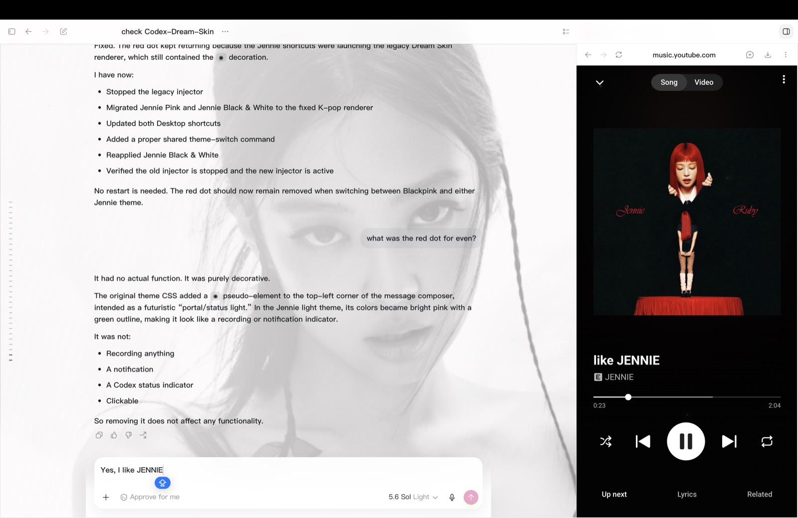

# Codex K-pop Theme

Mac-only Codex Skill for turning one K-pop photo into a complete, reversible desktop theme.

[](LICENSE)

## Examples

| BLACKPINK | JENNIE — Pink | JENNIE — Black & White |
| --- | --- | --- |
| [](examples/blackpink.jpg) | [](examples/jennie-pink.jpg) | [](examples/jennie-black-white.jpg) |

These screenshots demonstrate themes generated from user-supplied images. The repository does not bundle the original celebrity photos or grant rights to artist names, likenesses, trademarks, or lyrics.

## What it does

- Uses one user-supplied image.
- Asks at most one follow-up question: the artist/group name when uncertain.
- Derives the palette, copy, motifs, emoji, and layout automatically.
- Uses macOS Vision to detect all faces, center the group, and protect the highest head in the home hero.
- Uses a 60%-opacity Session reading panel.
- Creates named theme packs and optional Desktop shortcuts.
- Routes every saved-theme shortcut through the same current renderer, so fixes apply consistently across artists.
- Injects through loopback-only CDP; never edits `.app`, `app.asar`, signatures, API keys, or model providers.

It intentionally excludes Windows, SwiftBar, API relays, bundled celebrity images, and gallery mockups.

At the time of comparison, this repository contains roughly one-third as many physical source lines as the full [Fei-Away/Codex-Dream-Skin](https://github.com/Fei-Away/Codex-Dream-Skin) repository (about 2,400 versus 6,800). It is intentionally optimized for one focused use case: creating and running K-pop themes in Codex on macOS.

## Requirements

- macOS.
- Official Codex desktop surface installed and launched at least once (`com.openai.codex`).
- One PNG, JPEG, HEIC, TIFF, or WebP image, no larger than 50 MB.
- Recommended source: 3840×2160 landscape or 2400×2400 square; at least 2000 px on the long edge.

## Install the Skill

```bash
git clone https://github.com/yunhao-q/codex-kpop-theme.git \
  ~/.codex/skills/create-kpop-codex-theme
```

Restart Codex after installation so the Skill is discovered.

To update later:

```bash
git -C ~/.codex/skills/create-kpop-codex-theme pull
```

## Use it

Invoke the Skill in a new task:

```text
$create-kpop-codex-theme Turn this photo into a complete Mac Codex theme. Use English only.
```

Then attach one image. If the artist is visually uncertain, answer only the artist/group-name question. The Skill handles the remaining design decisions.

The Skill will:

1. Inspect the image composition and automatically calculate a group-safe, head-safe hero focus.
2. Derive an artist-aware concept, palette, short copy, project emoji, and one or two very short lyric fragments.
3. Generate and validate a theme pack.
4. Request permission before writing to Application Support, creating a Desktop shortcut, opening CDP, or restarting Codex.
5. Install, apply, and verify the live renderer.

Theme packs are stored under:

```text
~/Library/Application Support/CodexKpopTheme/themes/<theme-id>
```

After installation, open Codex using the generated theme shortcut whenever you want the theme active. The shortcut starts the official app and applies the selected theme; your normal Codex data and settings remain unchanged.

## Restore the normal appearance

With Codex running on the theme debug port:

```bash
~/.codex/skills/create-kpop-codex-theme/scripts/restore-theme-macos.sh
```

This removes injected DOM/CSS and stops only the recorded injector. It does not delete saved theme packs.

## Advanced manual build

Most users should invoke the Skill instead. For development:

```bash
NODE="/Applications/ChatGPT.app/Contents/Resources/cua_node/bin/node"

"$NODE" scripts/build-theme.mjs \
  --config /path/theme-config.json \
  --image /path/prepared-image.jpg \
  --output /path/theme-pack

"$NODE" scripts/injector.mjs \
  --check-payload \
  --theme-dir /path/theme-pack
```

See `references/theme-schema.md` for the config format.

## Rights and safety

Users must have the right to use supplied images. Artist names, trademarks, fan marks, and lyrics remain the property of their rightsholders. Automatically sourced lyrics stay extremely short; exact longer text is used only when supplied by the user.

The minimized CDP core is derived from Fei-Away/Codex-Dream-Skin under the MIT License; see `NOTICE.md`.

## License

The source code in this repository is available under the [MIT License](LICENSE). Example screenshots and third-party visual material remain subject to the rights described above and in [NOTICE.md](NOTICE.md).
